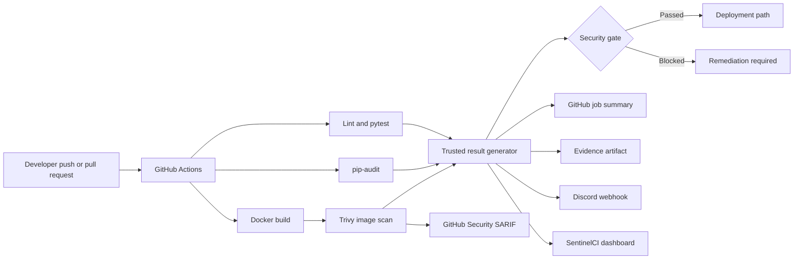
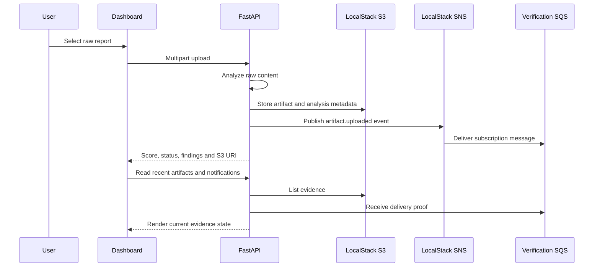

# SentinelCI Architecture

## System purpose

SentinelCI is a DevSecOps evidence platform. Its role is to take raw engineering
signals from a delivery pipeline, normalize them into one documented result,
apply a release policy, and present the outcome to both technical and
non-technical stakeholders.

The system does not treat a manually entered score as trusted evidence. The
score and release decision are calculated from scanner output generated during
the pipeline.

## End-to-end workflow

## Local AWS-compatible evidence path

## Trusted result schema

The pipeline creates `sentinelci-result.json`. It combines:

- GitHub run identity, branch, commit, actor, event and run URL
- lint and test status
- line coverage from `coverage.xml`
- dependency findings from `pip-audit-report.json`
- container findings from `trivy-report.json`
- normalized severity counts and remediation versions
- an internally calculated security score
- the release gate decision
- artifact and Discord integration state

## Security score model

The current score starts at 100 and applies these deductions:

| Severity | Deduction per finding |
|---|---:|
| Critical | 20 |
| High | 10 |
| Medium | 3 |
| Low | 1 |

The release gate is intentionally stricter than the score. Any critical or high
finding blocks the pipeline even when the numeric score remains high. This
avoids using an aggregate score to hide a severe individual risk.

## Deployment model

The project has two complementary execution modes:

1. The hosted Vercel dashboard is a read-only portfolio and observability view.
   It reads live public GitHub Actions status and committed representative
   evidence.
2. The local Docker Compose environment runs FastAPI, Nginx, and LocalStack. It
   supports live report analysis, S3 storage, SNS publication, and SQS delivery
   verification without requiring an AWS account.

This separation is deliberate. LocalStack is an integration simulator and is
not intended to be hosted inside a static Vercel deployment.
