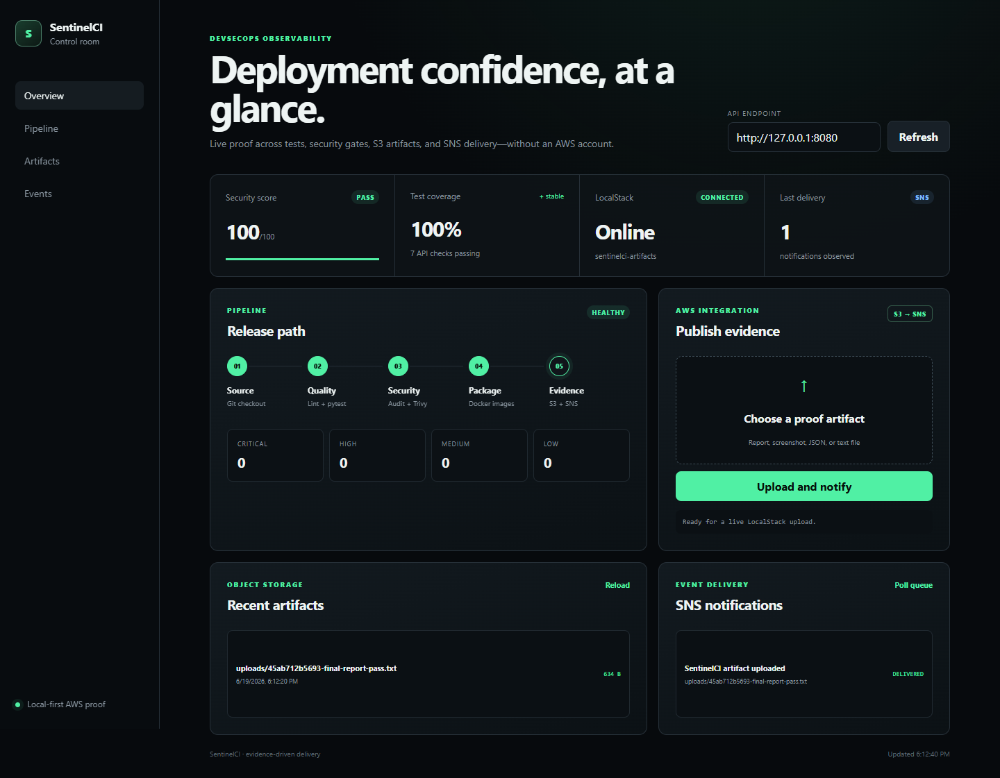
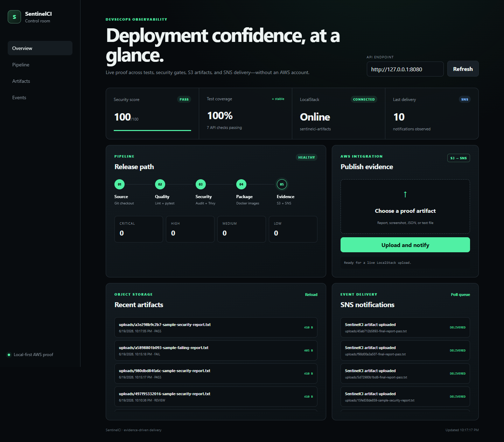
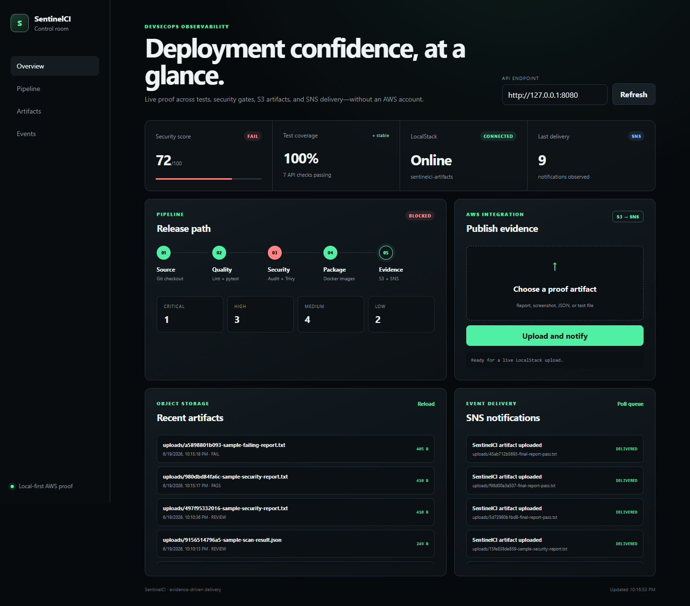
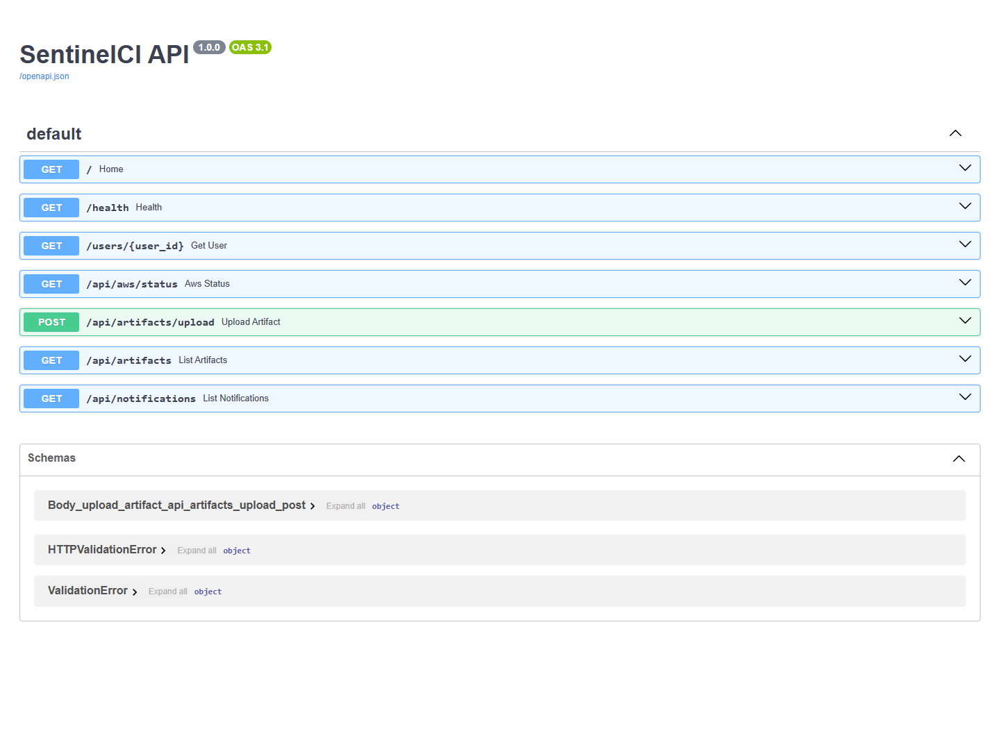
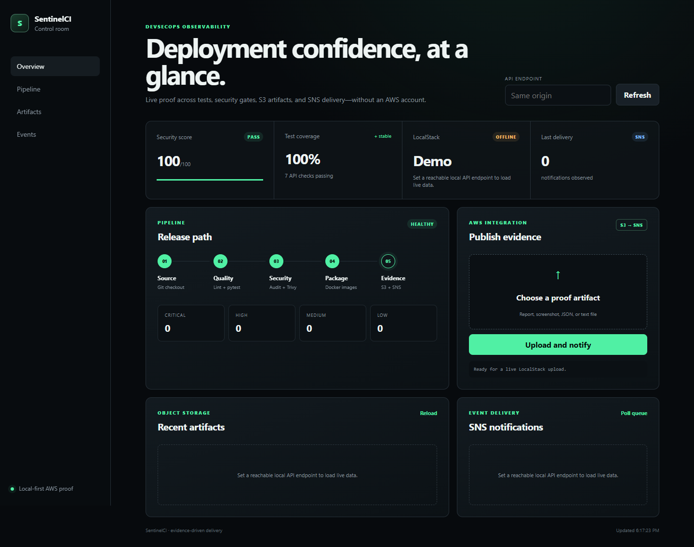
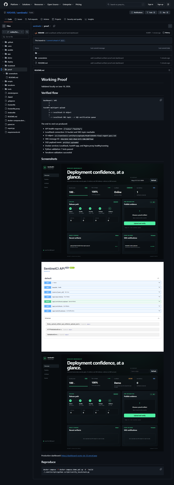

# Working Proof

Validated locally on June 19, 2026.

## Verified flow

```text
Dashboard / API
      |
      v
FastAPI multipart upload
      |
      +--> LocalStack S3 object
      |
      `--> LocalStack SNS topic --> SQS verification queue
```

The end-to-end run produced:

- API health response: `{"status":"healthy"}`
- LocalStack connection: S3 bucket and SNS topic reachable
- S3 object: `s3://sentinelci-artifacts/uploads/45ab712b5693-final-report-pass.txt`
- SNS message ID: `456c1b56-54d3-49e6-b371-190c288f76a4`
- SQS payload event: `artifact.uploaded`
- Docker services: LocalStack, FastAPI app, and Nginx proxy healthy/running
- Python validation: 7 tests passed
- Terraform validation: successful

## Screenshots













Production dashboard:
https://dashboard-sooty-six-33.vercel.app

## Reproduce

```powershell
docker compose -f docker-compose.demo.yml up -d --build
.\.venv\Scripts\python scripts\verify_localstack.py
```
